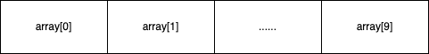
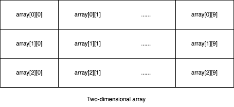

# 数组

在计算机科学中，**数组数据结构**（英语：array data structure），简称**数组**（英语：Array），是由相同类型的元素（element）的集合所组成的数据结构，由计算机分配一块连续的存储空间来存储。根据元素的索引（index）可以计算出该元素的存储地址。~~（存储空间和存储地址在第二章计组中介绍）~~

## 一维数组

一维数组是最基本、最简单的数组，例如长度为10，索引由0到9（大多数语言中数组从0开始计数）的32位整型数组。形式上如下：

每个元素的序号0、1...9等被称作该元素的索引或者下标。

数组的特点是可以通过索引直接访问对应元素。因为在数组创建并分配内存空间时，计算机会记录下数组第一个元素的存储地址（第一地址或基础地址），同时数组中存放的都是相同类型的元素，所以可以通过`第一地址+单个元素占用空间*索引`访问指定索引的元素。

## 多维数组

多维数组可以看作是对一维数组的拓展。如二维数组，形式上类似数学中的矩阵：

### 按行遍历还是按列遍历？

以二维数组为例，常见的存储形式是按行存储（待补图），即先存储\[0][0]，接着存储\[0][1]、\[0][2]...第一行存储完毕后再从\[1][0]开始存储第二行，直至存储完毕。故按行遍历效率更高。

## 定长数组、变长数组和动态数组

因为数组存储需要连续内存空间，所以大多数数组在程序编译时已经有了固定长度，这类数组叫做`定长数组`。而在运行时而非编译时才确定长度的数组叫做`变长数组`。`定长数组`和`变长数组`在其生存期内的长度都是固定的。

当需要存储超过数组长度的个数的元素时，就需要对`数组`进行扩容操作。扩容过程简单来说就是新建一个更长的数组，把旧数组中的元素复制到新数组，然后删除旧数组。支持扩容操作的数组叫做`动态数组`，动态数组指的是其他数据结构或包装类的内部实现。

## 数据结构特点

1. 查询/替换时间复杂度O(1)，插入/删除时间复杂度O(n)；
2. 结构简单，空间成本开销少。