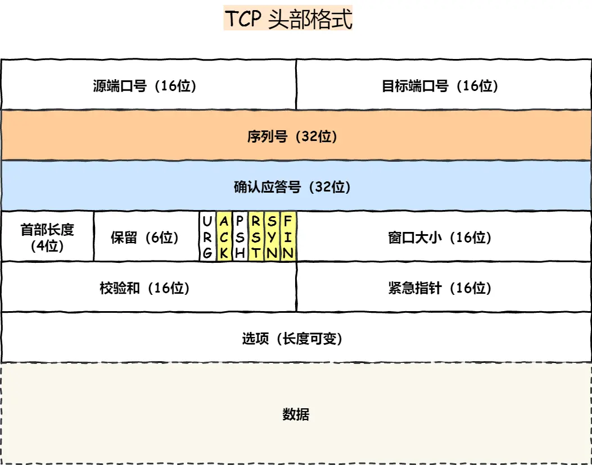

#Transmission Control Protocol
Transmission Control Protocol（TCP，传输控制协议）是一种end-to-end的、面向连接的、可靠的、基于字节流的传输层协议。  
##协议头部格式
  
<font color=gray><center>[图源网络]</center></font>  
##端到端（待补充）
TCP建立的连接是端到端的连接，“端”指的是“端口”，不同的端口标识了不同的进程。使用TCP头部等源端口号、目标端口号和网络层IP协议的源地址、目标地址即可确定唯一一个TCP连接。  
TCP和基于TCP的协议常用端口包括：20/21（FTP，文件传输协议）、22（SSH，安全远程登录协议）、25（SMTP，简单邮件传输协议）、8080（HTTP，超文本传输协议）等。
##面向连接
使用TCP通信时，需要先建立端到端的连接，在通信结束后会关闭连接。建立连接和关闭连接的过程被形象的表述为“三次握手”和“四次挥手”。  
###三次握手
  
<font color=gray><center>[图源网络]</center></font>  
“三次握手”指的是在建立一个TCP连接时，客户端和服务端会发送三个包用于确认连接。  
####握手流程
1. 第一次握手：客户端发送第一个包，该包header中的SYN标志位为1，同时选取一个序列号（假设为x）。发送完毕后，客户端进入`SYN_SEND`状态。  
2. 第二次握手：服务端接收到客户端发来的包后，会发送一个同步+确认包，该包header中的SYN和ACK标志位为1，同时选取自己的序列号（假设为y），确认应答号为x+1。发送完毕后，服务端进入`SYN_RCVD`状态。  
3. 第三次握手：客户端再次发送确认包，SYN标志位为0，ACK标志位为1，确认应答号为y+1。发送完毕后，客户端进入`ESTABLISHED`状态，当服务端接收到该包后，也进入`ESTABLISHED`状态，握手结束，连接建立。  

####为什么是三次？
简明版：要确认双方的SYN包和ACK包都被对方接收到，服务端的ACK包可以同时是SYN包，故至少需要三次**成功**发送包。  
详细版：（TODO） 
###四次挥手
  
<font color=gray><center>[图源网络]</center></font>    
“四次挥手”指的是在关闭一个TCP连接时，客户端和服务端会发送四个包用于确认连接。  
####挥手流程（TODO）
####为什么是四次？
简明版：因为TCP连接是双向的，客户端和服务端可以互相通信。单向关闭连接需要一次FIN包和一次ACK包，ACK包不太可能同时是FIN包，故双向关闭连接需要四次**成功**发送包。  
详细版：（TODO）  
##可靠性
TCP最重要的一点是可靠性，协议为了保证可靠传输提供了检验和、序列号/确认应答、超时重传、最大消息长度、滑动窗口控制等方法。
###校验和
###序列号/确认应答
###超时重传
###最大消息长度
###滑动窗口
###拥塞控制
TCP的起源最早可以追溯到二十世纪六十年代至七十年代。1970年，ARPANET主机开始使用网络控制协议(NCP)，这就是后来的传输控制协议(TCP)的雏形。彼时，网络中的流量远不及今天，随着网络的发展以及后来互联网的出现和普及，基于TCP的连接逐渐出现了网络拥堵、传输缓慢的现象，实际传输字节大小远低于理论值，也是便出现了拥塞控制。
####Additive-increase/Multiplicative-decrease，AIMD
加性增长/乘性降低 (Additive increase/multiplicative decrease，AIMD)算法是一个反馈控制算法，常被用于TCP的拥塞控制。  
加性增长：每次将传输速率增长固定量。
乘性降低：当检测到拥塞时，发送方将传输速率降低一个乘数；例如，数据丢失发生时将拥塞窗口降低到一半。
采用该算法的传输速率随时间变化的结果是锯齿形的，体现对可用带宽的探测。  
算法伪代码如下：

```
data_size = value; //初始化传输数据大小
if(data_size <= threshold) {  //当传输数据大小小于网络阈值时
	data_size += a  // 传输数据大小加性增长
} else {   //当传输数据大小大于网络阈值时
	data_size = data_size / b;  // 传输数据大小乘性降低
}
```
在TCP中，加性增长参数a通常为每个RTT一个MSS，而乘性降低因子b通常为1/2。TCP探测网络达到拥堵是通过超时重传机制，当发送端连续收到三个ACK为x的包时，便认为此时网络达到了拥堵状态，发送完序号为x的包后便会进入乘性降低。
  
<font color=gray><center>[图源网络]</center></font>    
在路由拥有缓存的前提下采用AIMD算法，尽管发送端传输效率不是一直100%，但是路由端的传输效率能一直达到100%。（具体分析和图待补充）  
